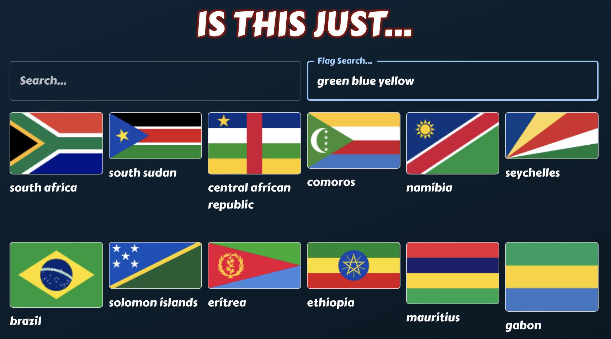

# Is this just...
A geoguessr meta/learning website experiment.

Features:
- Freetext fuzzy search
  - Matches any written markdown content, country information, etc.
- Flag color search
  - Any separator (e.g. "blue, white", "blue$white" or just with spaces)
  
TODO:
- [ ] Adjust UI for better grid view with expandable cards
- [ ] Improve flag search and sort by highest match amount
- [ ] Improve caching

## Local development
### `npm start`
Runs the app in the development mode.\
Open [http://localhost:3000](http://localhost:3000) to view it in your browser.

## Deployment
### `npm run build`
Builds the app for production to the `build` folder.\
It correctly bundles React in production mode and optimizes the build for the best performance.

The build is minified and the filenames include the hashes.\
Your app is ready to be deployed!

See the section about [deployment](https://facebook.github.io/create-react-app/docs/deployment) for more information.
### `firebase deploy`
With the right secrets, you can upload to firebase.